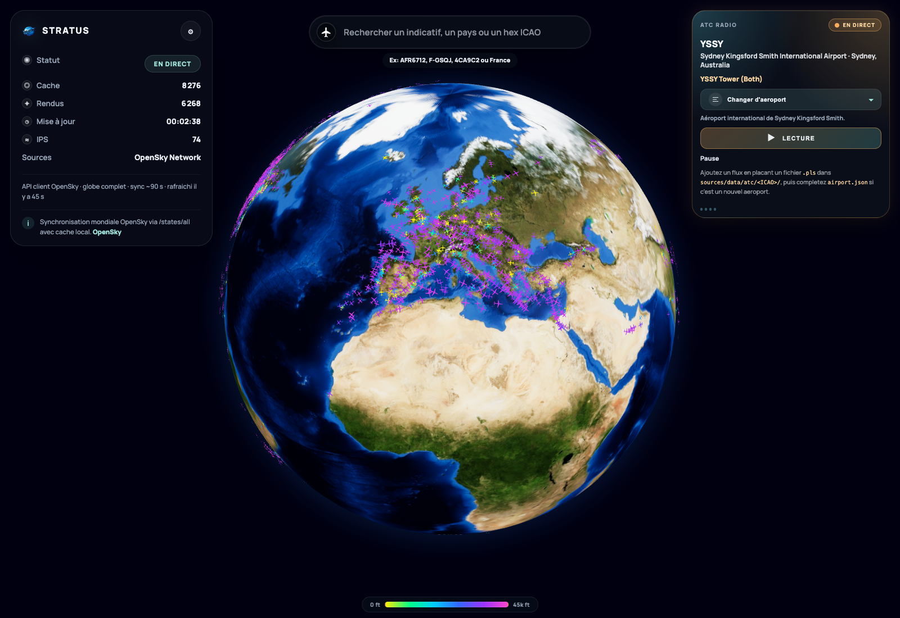
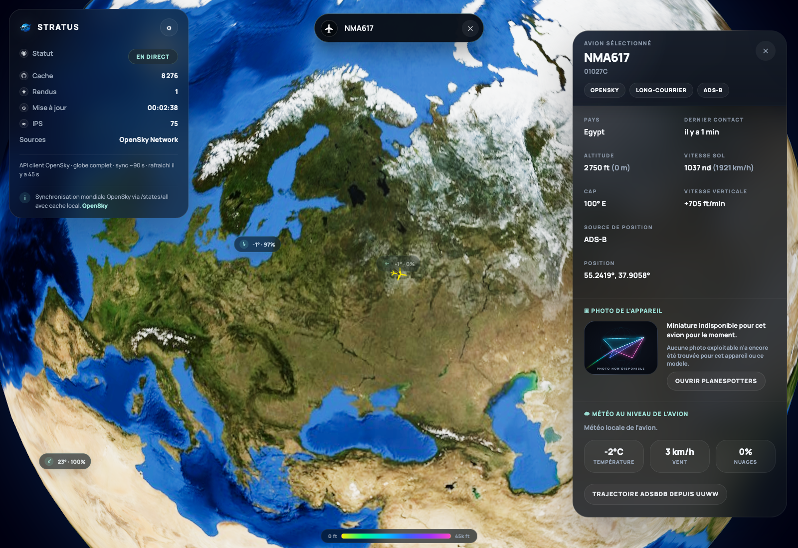
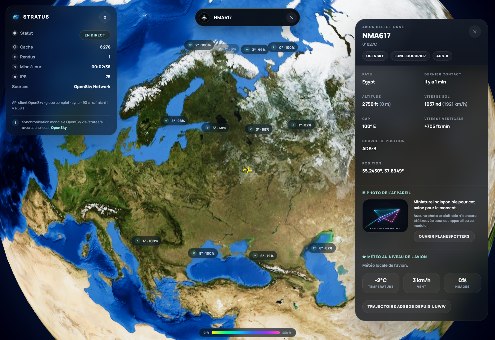
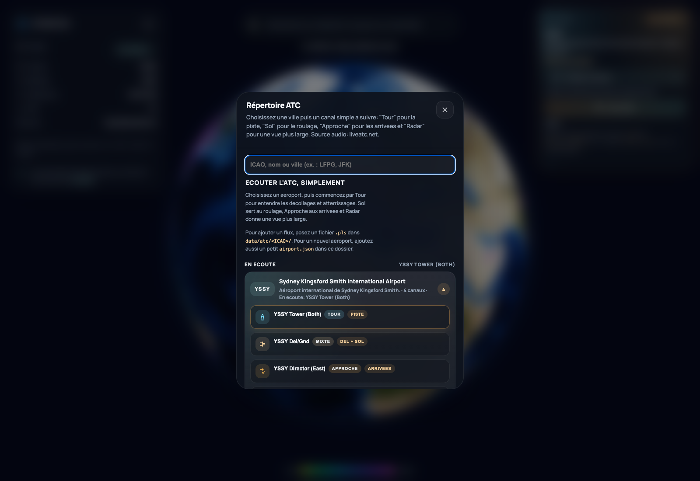
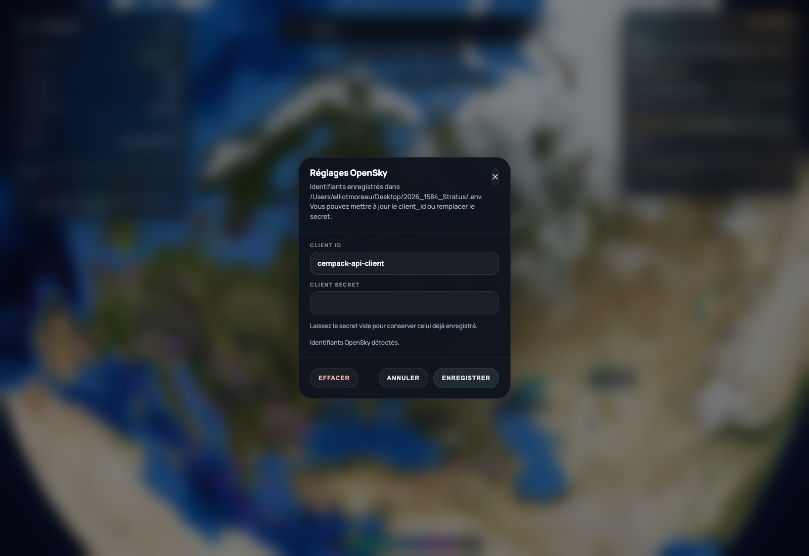

<div align="center">

<h1>Stratus</h1>
<p><strong>Suivi aérien en temps réel sur globe 3D</strong></p>
<p>OpenSky · Flask · JavaScript</p>
</div>

## Aperçu

Stratus affiche les avions sur un globe 3D et ajoute autour de cette vue :

- une recherche radar,
- une fiche avion détaillée,
- une couche météo,
- un répertoire radio ATC,
- des réglages OpenSky.

## Lancement

Depuis la racine :

```bash
python3 -m venv .venv
source .venv/bin/activate
pip install -r requirements.txt
python3 main.py
```

Le lanceur fonctionne aussi avec `python3 main.py --no-browser`.

## Configuration OpenSky

Le projet peut tourner sans identifiants, mais le mode authentifié est recommandé.

Les identifiants peuvent être ajoutés :

- depuis l'interface,
- ou via `.env` à la racine.

Exemple :

```env
OPENSKY_CLIENT_ID=your_client_id
OPENSKY_CLIENT_SECRET=your_client_secret
```

## Captures

### Vue d'ensemble



### Recherche radar



### Fiche avion



### Radio ATC



### Réglages OpenSky



## Structure rapide

| Chemin | Rôle |
| :-- | :-- |
| `main.py` | point d'entrée conseillé |
| `sources/` | code de l'application |
| `data/assets/app/` | assets runtime |
| `data/cache/` | cache OpenSky |
| `data/atc/` | fichiers radio ATC |
| `docs/` | documentation de reprise |
| `example/` | captures et tutoriels |

## Documentation

- [docs/reprise-rapide.md](docs/reprise-rapide.md)
- [docs/structure-projet.md](docs/structure-projet.md)
- [docs/fonctionnalites.md](docs/fonctionnalites.md)
- [docs/donnees-et-assets.md](docs/donnees-et-assets.md)
- [presentation.md](presentation.md)

## Exemples

- [example/README.md](example/README.md)
- [example/tutorials/01-globe-et-demarrage.md](example/tutorials/01-globe-et-demarrage.md)
- [example/tutorials/02-recherche-et-selection.md](example/tutorials/02-recherche-et-selection.md)
- [example/tutorials/03-fiche-avion.md](example/tutorials/03-fiche-avion.md)
- [example/tutorials/04-radio-atc.md](example/tutorials/04-radio-atc.md)
- [example/tutorials/05-reglages-opensky.md](example/tutorials/05-reglages-opensky.md)
