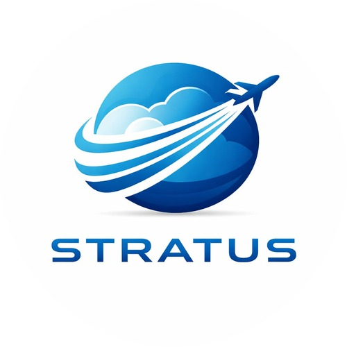
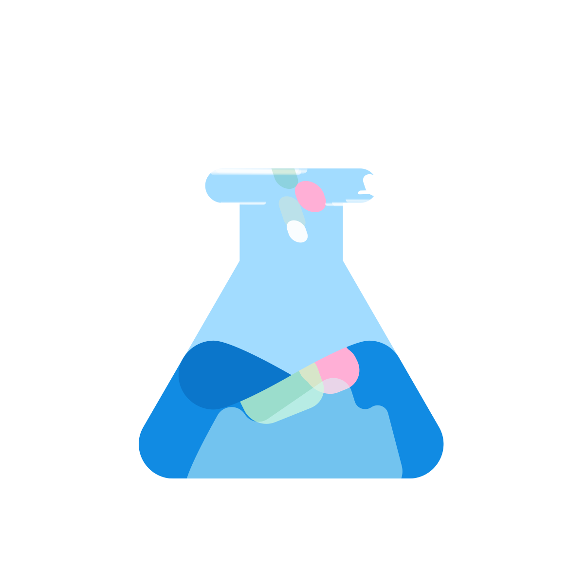
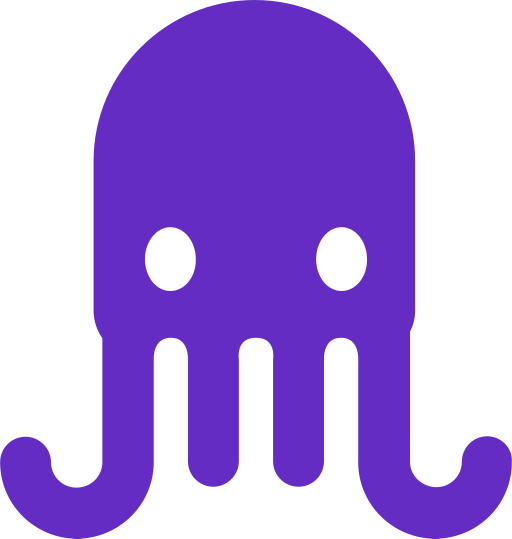

<!-- En-tête en HTML : GitHub ne traite pas le Markdown à l’intérieur des blocs 
. -->

<h1> Présentation du modèle</h1>

Document de présentation du projet **Stratus**. Les images utilisent des **chemins relatifs à la racine du dépôt** pour un rendu correct sur **GitHub** et en prévisualisation locale.

---

##  Présentation globale

Stratus est un **tracker de vols en 3D** basé sur des **API gratuites permettant d'obtenir des données sur les vols d'avions**.

L'idée de ce projet nous est venue car nous nous intéressons beaucoup à **l'aviation et au monde de l'aéronautique**. Lors d'un cours sur les **API**, nous nous sommes renseignés sur les différentes API existantes et nous avons découvert qu'il en existait certaines permettant d'obtenir gratuitement des informations sur les vols d'avions.

Nous avons alors eu l'idée de **recréer un tracker de vols**, mais en essayant de proposer quelque chose de différent des trackers classiques, en le réalisant **en 3D**.

La 3D étant un domaine que nous ne connaissions pas beaucoup, nous avons dû **faire des recherches et apprendre de nouvelles notions** afin de pouvoir créer la Terre et les avions en trois dimensions et les afficher dans l'interface.

> L'objectif de notre solution est donc de **visualiser les vols d'avions en temps réel dans un environnement 3D**, grâce aux données récupérées par les API.

---

##  Présentation de l'équipe

Notre équipe est composée de **trois élèves de la classe 702**. Nous avons réparti les tâches en fonction des compétences et des centres d'intérêt de chacun.

###  Antoine HERITIER

- **Création du logo** du projet
- **Montage de la vidéo** de présentation
- **Recherche des différentes API** permettant d'obtenir les données de vols

###  Titouan SOLEILHAVOUP

- **Implémentation de la Terre et des avions en 3D**
- **Intégration des API dans le code**
- **Rédaction de la documentation**

###  Elliot MOREAU

- **Développement du code de base du tracker**
- **Création de l'interface**
- **Amélioration et correction des problèmes**

Cette organisation nous a permis de **travailler efficacement en équipe**, chacun contribuant à une partie technique du projet.

---

##  Étapes du projet

Les principales étapes de notre projet ont été les suivantes :

| Étape | Description |
| :-- | :-- |
| **1.** | Recherche de l'idée du projet |
| **2.** | Lancement du projet |
| **3.** | Création du code et des objets en 3D |
| **4.** | Ajout des API dans le code |
| **5.** | Correction et amélioration de l'interface graphique |
| **6.** | Amélioration et peaufinage du projet |

---

##  Validation de l'opérationnalité et du fonctionnement

Au moment du dépôt du projet, notre application permet déjà de **récupérer des données de vols grâce aux API et de les afficher dans un environnement 3D**.

Pour vérifier le bon fonctionnement du programme, nous avons :

- testé plusieurs fois l'intégration des **API dans le code**,
- vérifié l'**affichage des objets 3D**,
- corrigé les **problèmes liés à l'interface graphique**.

Nous avons rencontré plusieurs difficultés, notamment :

- la **prise en main de la 3D**, que nous ne maîtrisions pas au début,
- l'**intégration des données des API dans le programme**.

Pour résoudre ces problèmes, nous avons effectué **des recherches, des tests et plusieurs corrections du code** afin d'améliorer progressivement le projet.

---

##  Ouverture

Nous avons tous les trois **apprécié travailler ensemble sur ce projet**. Cela nous a permis de découvrir de nouveaux domaines comme **l'utilisation d'API et la création d'objets en 3D**.

Pour améliorer le projet à l'avenir, nous pourrions :

- ajouter **plus de fonctionnalités au tracker**,
- améliorer **l'interface graphique**,
- rendre la **visualisation des vols encore plus précise et interactive**.

Ce projet nous a permis de développer plusieurs compétences :

- le **travail en équipe**,
- la **programmation**,
- la **recherche de solutions techniques**,
- la **découverte de nouvelles technologies**.

---

##  Utilisation de l'IA

**Rapport de notre utilisation de l’IA dans le projet**

Dans le cadre de ce projet, nous avons notamment utilisé des outils d’assistance tels que **Stitch** (Google), **Cursor**, **Antigravity** (Google) et **Jules** (Google).

| Outil | Rôle dans le projet |
| :-- | :-- |
|  **Stitch** (Google) | _Création de maquettes pour le design de l’application._ |
|  **Cursor** | _Édition assistée et refactoring._ |
|  **Antigravity** (Google) | _Implémentation d’éléments 3D complexes et du système de cache._ |
|  **Jules** (Google) | _Suggestions de revues de code et de corrections de bugs._ |
